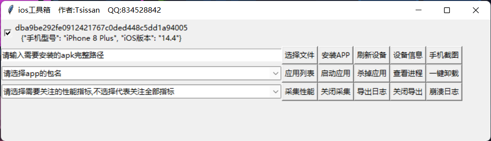

## 效果图


## 使用方法
   - python版本3.6+
   - 需要安装iTunes
   - pip install -U tidevice
   - 手机连上电脑后需信任此电脑
## 功能介绍
   - 所有功能都是多线程操作，连接的设备默认是选中状态，如果同时连接多台设备需要注意勾选使用哪台设备
   - 选择文件
   > 调起Windows的文件资源管理器,选择你要安装的ipa包
   - 安装APP
   > 安装你选择的应用
   - 刷新设备
   > 当有新设备接入电脑需要刷新重新获取设备列表
   - 设备信息
   > 获取手机的设备信息
   - 手机截图
   > 自动截图并保存在D盘ios_screenshot文件夹下并以截图时间命名
   - 应用列表
   > 会在命令窗口输出手机安装的应用以便获取APP的包名
   - 启动应用
   > 在下拉框中选择你要启动的应用,点击即可打开该包名的应用
   - 杀掉应用
   > 在下拉框中选择你要杀掉的应用,点击即可杀掉该包名的应用
   - 查看进程
   > 不填包名则查看所有正在运行应用的进程信息,选择包名后则只查看该应用的进程信息
   - 一键卸载
   > 在下拉框中选择你要卸载的应用,点击即可卸载该包名的应用
   - 采集性能
   > 点击会打开新能采集功能,会在命令窗口实时输出你选择的应用的cpu、fps、memory、network数据
   - 关闭采集
   > 点击关闭性能采集功能
   - 导出日志
   > 会把日志不停输出到D盘的ios_log文件夹下,以当前时间命名
   - 关闭导出
   > 日志一直在静默导出,点击关闭导出日志的功能

## 拓展
   - 如果需要拓展功能,编写完代码后在项目目录下的终端窗口输入下面命令进行打包
   ```python
pyinstaller -F ios_toolbox.py
```
   - 打包成功后会在当前目录下生成dist文件,其中exe文件就在该文件夹下